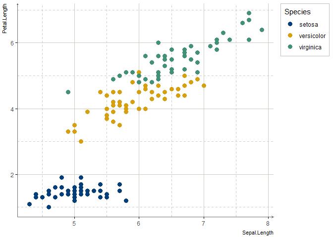

<!-- README.md is generated from README.Rmd. Please edit that file -->

# unam.theme

<!-- badges: start -->

[](https://www.tidyverse.org/lifecycle/#maturing)
<!-- badges: end -->

The goal of unam.theme is to provide a ggplot2 theme using UNAM’s
graphic identity.

*Academic/Non-commercial use only.*

## Installation

You can install the development version from
[GitHub](https://github.com/) with:

``` r
# install.packages("devtools")
devtools::install_github("alberto-mateos-mo/unam.theme")
```

## Example

The custom theme and scales are used as follows:

``` r
library(unam.theme)
library(ggplot2)

ggplot(iris)+
  geom_point(aes(x = Sepal.Length, y = Petal.Length, colour = Species), size = 3)+
  scale_colour_unam()+
  theme_unam()
```



Using secondary palette:

``` r
library(unam.theme)
library(ggplot2)

ggplot(iris)+
  geom_point(aes(x = Sepal.Length, y = Petal.Length, colour = Species), size = 3)+
  scale_colour_unam(palette = "secondary")+
  theme_unam()
```


Using a continuous scale:

``` r
library(unam.theme)
library(ggplot2)

ggplot(iris)+
  geom_point(aes(x = Sepal.Length, y = Petal.Length, colour = Petal.Width), size = 3)+
  scale_colour_unam(palette = "basic", discrete = FALSE)+
  theme_unam()
```


Note: UNAM’s graphic image consists of at most three colours: \#003D79,
\#D59F0F and \#B6985E, additional colours were selected using
[colormind.io](http://colormind.io/) site.
